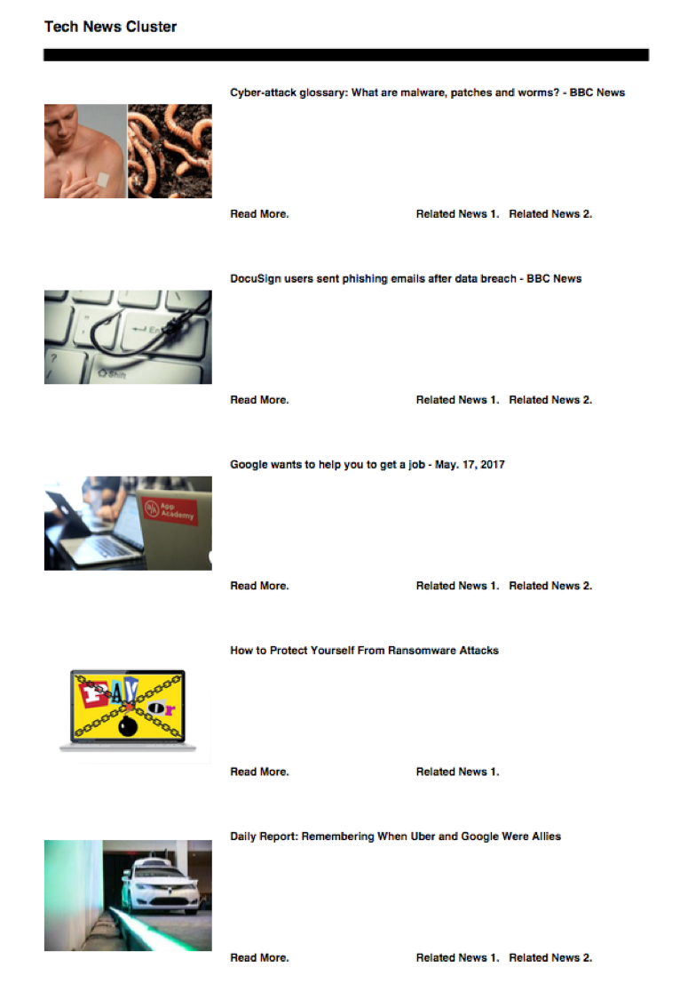

# A News Clustering Crawler
----------------------------
### Contributor:
* Xiaoxiao Liu	 (xliu91@jhu.edu)
* Da Chen    (dachen78@jhu.edu)

### Domain:

	Our project focuses on building an intelligent web news crawler whose goal is to find the latest, hottest technology news. This crawler can crawl through the main news authorities (such as New York Times, CNN, BBC) and group similar news together base on their similarity.

### Run our code:

	We have made a bash script that have connected all the scripts in our project in order. Just run this script by $ bash run.sh. Easy and efficient!

### Motivation:

	In modern days, with the explosion of information, it is extremely time consuming to read all news from different news websites. Especially many of them report news with different titles but almost the same contents. To save people’s time and energy, we may try to collect news from different websites and compare their similarities so as to generate a report for certain date’s news with less redundancy and provide links in case people want to read deeply. 

### Sample Result: 

### Highlights:
* Filtering

	In our crawler we have made the following rules to make sure the news fetched back is the most accurate, latest, hottest and related news in the technology field from different major news authorities on the internet.
  1)	only select news posted within 7 days from today
  2)	only within certain depth of crawling 
  3)	only within a certain news authority domain
  4)	only related to Technology topics

* Cached data

	We used database (sqlite3) to store crawled urls and data to avoid having to requesting the same web page again and again (performing politeness). Each time a new url is to be crawled, it is first checked in the cache database to determine new or old. 
	
* Clustering by similarity

	We calculated the similarity of each pair of doc vectors and performed ranking in two times, first rank all doc vectors by the summation of similarity for each vector (ranking the rows), then rank all other vectors by their similarity to this current vector. In the process, zero similarities are excluded and each vector can only belong to one final cluster in order for duplication-free (which, in effect, “saves our readers time”).

* DATA VISUALIZATION

	We render out result in a well-formatted pdf file with clickable links, images and text. 

### Complexity: 
1.	Our crawler can automatically extract and uniform certain data from complex html structures from different websites.
2.	As the second major part of our project, we used our own tools (such as tokenizer) first generate the required materials for computing similarity, which includes raw, tokenized doc, hist and title files. With these srouce material, we next calculate the similarity, cluster together similar ones and then performed ranking.

